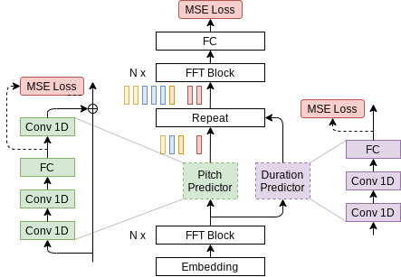

# FastPitch 1.0 for PyTorch ( modified by Hyungon Ryu) 

This repository is unofficial FastPitch repository maintained by Hyungon Ryu.

if you want to check official FastPitch 
 - [Samples](https://fastpitch.github.io/) 
 - [NGC source link](https://ngc.nvidia.com/catalog/resources/nvidia:fastpitch_for_pytorch/)
 - [NVIDIA Deep Learning Examples](https://github.com/NVIDIA/DeepLearningExamples/tree/master/PyTorch/SpeechSynthesis/FastPitch) 
 - [paper](https://arxiv.org/abs/2006.06873)

## Table Of Contents

- [Model overview](#model-overview)
    * [Model architecture](#model-architecture)
    * [Default configuration](#default-configuration)
        * [Features](#features)
 
 

## Model overview

[FastPitch](https://arxiv.org/abs/2006.06873) is one of two major components in a neural, text-to-speech (TTS) system:

* a mel-spectrogram generator such as [FastPitch](https://arxiv.org/abs/2006.06873) or [Tacotron 2](https://arxiv.org/abs/1712.05884), and
* a waveform synthesizer such as [WaveGlow](https://arxiv.org/abs/1811.00002) (see [NVIDIA example code](https://github.com/NVIDIA/DeepLearningExamples/tree/master/PyTorch/SpeechSynthesis/Tacotron2)).

Such two-component TTS system is able to synthesize natural sounding speech from raw transcripts.

The FastPitch model generates mel-spectrograms and predicts a pitch contour from raw input text. It allows to exert additional control over the synthesized utterances, such as:
* modify the pitch contour to control the prosody,
* increase or decrease the fundamental frequency in a naturally sounding way, that preserves the perceived identity of the speaker,
* alter the pace of speech.
Some of the capabilities of FastPitch are presented on the website with [samples](https://fastpitch.github.io/).

Speech synthesized with FastPitch has state-of-the-art quality, and does not suffer from missing/repeating phrases like Tacotron2 does.
This is reflected in Mean Opinion Scores ([details](https://arxiv.org/abs/2006.06873)).

| Model     | Mean Opinion Score (MOS) |
|:----------|:-------------------------|
| Tacotron2 | 3.946 ± 0.134            |
| FastPitch | 4.080 ± 0.133            |

The FastPitch model is based on the [FastSpeech](https://arxiv.org/abs/1905.09263) model. The main differences between FastPitch and FastSpeech are that FastPitch:
* explicitly learns to predict the pitch contour,
* pitch conditioning removes harsh sounding artifacts and provides faster convergence,
* no need for distilling mel-spectrograms with a teacher model,
* [character durations](#glossary) are extracted with a pre-trained Tacotron 2 model.

The FastPitch model is similar to [FastSpeech2](https://arxiv.org/abs/2006.04558), which has been developed concurrently. FastPitch averages pitch values over input tokens, and does not use additional conditioning such as the energy.

FastPitch is trained on a publicly
available [LJ Speech dataset](https://keithito.com/LJ-Speech-Dataset/).

This model is trained with mixed precision using Tensor Cores on Volta, Turing, and the NVIDIA Ampere GPU architectures. Therefore, researchers can get results from 2.0x to 2.7x faster than training without Tensor Cores, while experiencing the benefits of mixed precision training. This model is tested against each NGC monthly container release to ensure consistent accuracy and performance over time.

### Model architecture

FastPitch is a fully feedforward [Transformer](#glossary) model that predicts mel-spectrograms
from raw text (Figure 1). The entire process is parallel, which means that all input letters are processed simultaneously to produce a full mel-spectrogram in a single forward pass.

  

  <em>Figure 1. Architecture of FastPitch (<a href=”https://arxiv.org/abs/2006.06873”>source</a>). The model is composed of a bidirectional Transformer backbone (also known as a Transformer encoder), a pitch predictor, and a duration predictor. After passing through the first *N* Transformer blocks, encoding, the signal is augmented with pitch information and discretely upsampled. Then it goes through another set of *N* Transformer blocks, with the goal of
smoothing out the upsampled signal, and constructing a mel-spectrogram.
  </em>

## TODO list ( delta from original )
- seperate scripts and code.
   
- use phoneme instead of raw text
- add SV(speaker verification) d-vector embeddings from VoxCeleb2 and speaker embedding from LibriTTS
- cosine LR schedule for large BatchSize for scale up ( upto 64 GPUs) 
- modified STFT algorithm and support other vocoder 

### Getting Started Guide.

#### prepare 
1. clone source
2. download dataset
3. extract dataset 
3. download tacoton2 and waveglow checkpoint 
4. prepare dataset for training ( wavs, mel, duration, pitch)

#### inference
1. download waveglow checkpoint fastpitch checkpoint.
2. inference
3. compare voice 
 1. wave original
 2. wave  from original mel  w/ waveglow vocoder
 3. wave from synthesized mel w/ waveglow vocoder

#### train
1. train w/ train script
 
